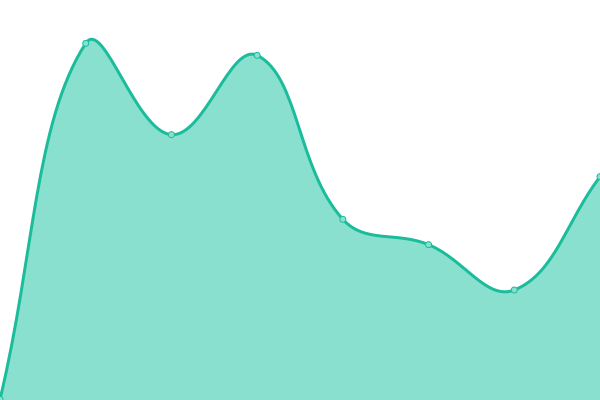
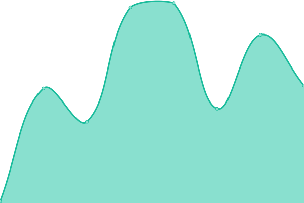
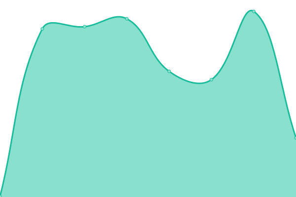
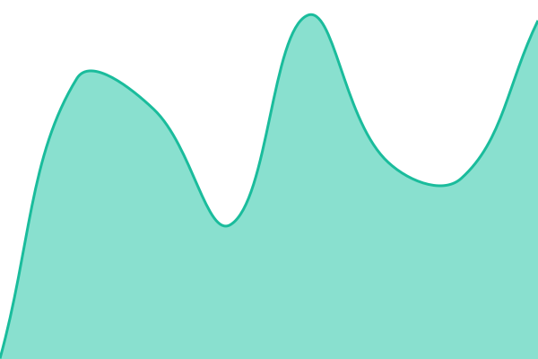

# [📈 Live Status](https://Nookturnal.github.io/upptime): <!--live status--> **🟩 All systems operational**

This repository contains the open-source uptime monitor and status page for [Nookturnal](https://Nookturnal.github.io/upptime), powered by [Upptime](https://github.com/upptime/upptime).

With [Upptime](https://upptime.js.org), you can get your own unlimited and free uptime monitor and status page, powered entirely by a GitHub repository. We use [Issues](https://github.com/Nookturnal/upptime/issues) as incident reports, [Actions](https://github.com/Nookturnal/upptime/actions) as uptime monitors, and [Pages](https://Nookturnal.github.io/upptime) for the status page.

<!--start: status pages-->
<!-- This summary is generated by Upptime (https://github.com/upptime/upptime) -->
<!-- Do not edit this manually, your changes will be overwritten -->
<!-- prettier-ignore -->
| URL | Status | History | Response Time | Uptime |
| --- | ------ | ------- | ------------- | ------ |
|  [Nookturnal Lab](https://www.nookturnal.com/) | 🟩 Up | [nookturnal-lab.yml](https://github.com/nookturnal/nookturnal-upptime/commits/HEAD/history/nookturnal-lab.yml) | 

 227ms
     
 | 

<a href="https://status.nookturnal.com/history/nookturnal-lab">98.73%</a>
    

|  [StaffConnect Solutions](https://www.staffconnect.ph/) | 🟩 Up | [staff-connect-solutions.yml](https://github.com/nookturnal/nookturnal-upptime/commits/HEAD/history/staff-connect-solutions.yml) | 

 258ms
     
 | 

<a href="https://status.nookturnal.com/history/staff-connect-solutions">98.78%</a>
    

|  [Property Portal](https://www.propertyportal.ph/) | 🟩 Up | [property-portal.yml](https://github.com/nookturnal/nookturnal-upptime/commits/HEAD/history/property-portal.yml) | 

 218ms
     
 | 

<a href="https://status.nookturnal.com/history/property-portal">100.00%</a>
    

|  [Topnotch Real Estate Review Center](https://www.topnotchreviewcenter.com/) | 🟩 Up | [topnotch-real-estate-review-center.yml](https://github.com/nookturnal/nookturnal-upptime/commits/HEAD/history/topnotch-real-estate-review-center.yml) | 

 2133ms
     
 | 

<a href="https://status.nookturnal.com/history/topnotch-real-estate-review-center">100.00%</a>
    

|  [Moorgate Lending](https://www.moorgateph.com/) | 🟩 Up | [moorgate-lending.yml](https://github.com/nookturnal/nookturnal-upptime/commits/HEAD/history/moorgate-lending.yml) | 

 278ms
     
 | 

<a href="https://status.nookturnal.com/history/moorgate-lending">98.82%</a>
    

|  [Zugbu Aesthetic](https://www.zugbuaesthetic.com/) | 🟩 Up | [zugbu-aesthetic.yml](https://github.com/nookturnal/nookturnal-upptime/commits/HEAD/history/zugbu-aesthetic.yml) | 

 280ms
     
 | 

<a href="https://status.nookturnal.com/history/zugbu-aesthetic">98.87%</a>
    

<!--end: status pages-->

[**Visit our status website →**](https://Nookturnal.github.io/upptime)

## 📄 License

- Powered by: [Upptime](https://github.com/upptime/upptime)
- Code: [MIT](./LICENSE) © [Anand Chowdhary](https://anandchowdhary.com), supported by [Pabio](https://pabio.com)
- Data in the `./history` directory: [Open Database License](https://opendatacommons.org/licenses/odbl/1-0/)
